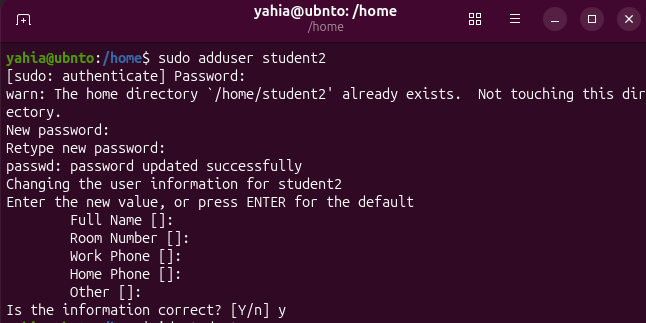
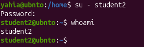
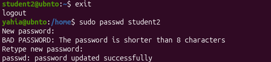
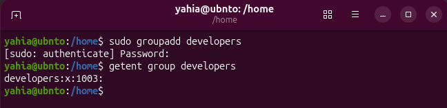
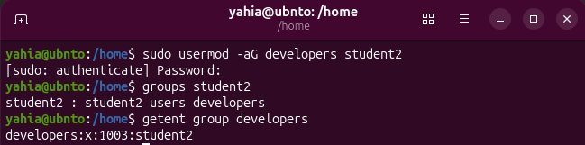
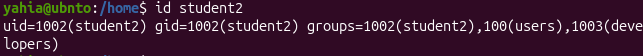
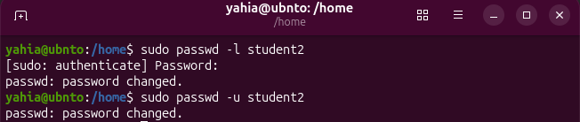
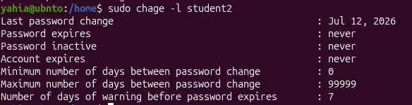
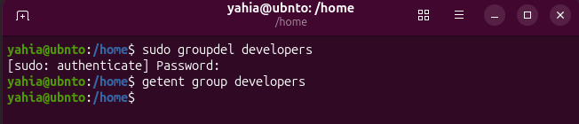
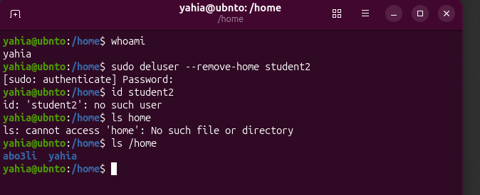

# Linux User and Group Management

A practical Ubuntu project demonstrating essential Linux user and group administration tasks through the command line.

## Project Overview

This project demonstrates the complete lifecycle of Linux user and group management, including account creation, password management, group membership, account security, and safe deletion.

## Skills Practiced

- Creating Linux users
- Verifying user information
- Switching between users
- Changing user passwords
- Creating and managing groups
- Adding users to groups
- Viewing user and group information
- Locking and unlocking user accounts
- Viewing password aging information
- Removing users from groups
- Deleting groups
- Deleting users and their home directories

## Commands Used

```bash
# Create a new user
sudo adduser student2

# Display user information
id student2

# Switch to the new user
su - student2

# Display the current username
whoami

# Change the user's password
sudo passwd student2

# Create a new group
sudo groupadd developers

# Add the user to the group
sudo usermod -aG developers student2

# Display the user's groups
groups student2

# Display the group's members
getent group developers

# Lock the user account
sudo passwd -l student2

# Unlock the user account
sudo passwd -u student2

# Display password aging information
sudo chage -l student2

# Remove the user from the group
sudo gpasswd -d student2 developers

# Delete the group
sudo groupdel developers

# Delete the user and its home directory
sudo deluser --remove-home student2
```

## Project Structure

```text
linux-user-management/
├── README.md
└── screenshots/
    ├── 01-create-user.png
    ├── 02-check-user.png
    ├── 03-switch-user.png
    ├── 04-change-password.png
    ├── 05-create-group.png
    ├── 06-add-user-to-group.png
    ├── 07-user-information.png
    ├── 08-lock-unlock-user.png
    ├── 09-password-aging.png
    ├── 10-remove-user-from-group.png
    ├── 11-delete-group.png
    └── 12-delete-user.png
```

## Screenshots

### 1. Create a User



### 2. Verify User Information


### 3. Switch Between Users



### 4. Change the User Password



### 5. Create a Group



### 6. Add the User to the Group



### 7. View User and Group Information



### 8. Lock and Unlock the User Account



### 9. View Password Aging Information



### 10. Remove the User from the Group


### 11. Delete the Group



### 12. Delete the User



## What I Learned

Through this project, I learned how to create, manage, verify, secure, and delete Linux users and groups using the Ubuntu terminal. I also gained practical experience with account locking, password management, group membership, and administrative Linux commands.

## Environment

- Ubuntu Linux
- Bash terminal

## Author

**Yahya Al-Awbathani**  
Computer Science Student
